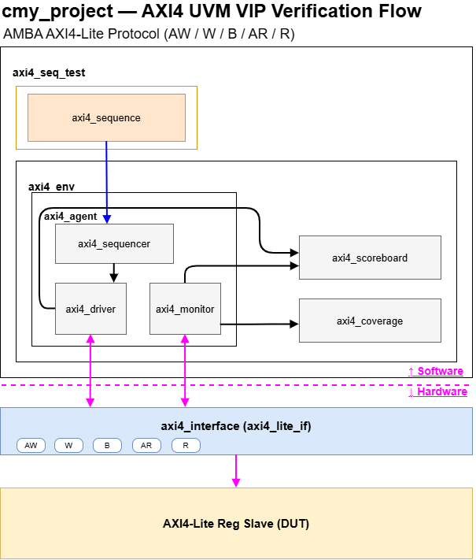

# AXI_RV32I_UVM_Verification

AXI4-Lite / APB UVM VIP를 설계하고, 이를 이용해 RV32I 5-stage 파이프라인 CPU와 AXI-APB 브리지를 검증하는 프로젝트입니다. 팹리스 SoC 설계/검증 직무 포트폴리오로 진행했으며, **Phase 1~3 전체 완료**된 상태입니다.

## Verification Flow



## Overview

| 항목 | 내용 |
|---|---|
| 검증 방법론 | UVM (Universal Verification Methodology) |
| 시뮬레이터 | Synopsys VCS |
| 디버깅 툴 | Synopsys Verdi |
| 언어 | SystemVerilog |
| 진행 단계 | Phase 1 완료 (AXI4 VIP), Phase 2 완료 (RV32I 5-stage 파이프라인 CPU), Phase 3 완료 (APB VIP + AXI-APB 브리지) |

## Phase 1 — AXI4-Lite UVM VIP

재사용 가능한 AXI4-Lite UVM VIP(interface, transaction, sequence, sequencer, driver, monitor, agent, scoreboard, coverage)를 직접 설계하고, 예제 AXI4-Lite 레지스터 슬레이브 DUT를 대상으로 write-read 데이터 무결성을 검증했습니다.

### 결과

| 항목 | 결과 |
|---|---|
| 총 트랜잭션 | write 13 / read 13 (랜덤 5쌍 + directed 8쌍) |
| Scoreboard | PASS 13 / FAIL 0 |
| Functional Coverage | **100%** |
| UVM_ERROR / UVM_FATAL | 0 / 0 |

Coverage 항목: write/read 여부(cp_rw), 레지스터별 접근(cp_addr), 데이터 패턴(cp_data: zero/all_one/others), 레지스터×R/W cross coverage(cx_addr_rw).

### 구조

```
work/
├── vip/axi4/              # 재사용 가능한 AXI4-Lite UVM VIP
│   ├── axi4_interface.sv
│   ├── axi4_transaction.sv
│   ├── axi4_sequencer.sv
│   ├── axi4_sequence.sv
│   ├── axi4_driver.sv       # reset wait, AW/W 병렬 handshake, timeout
│   ├── axi4_monitor.sv      # AW/W 병렬 캡처
│   ├── axi4_agent.sv
│   └── axi4_coverage.sv
├── rtl/example_dut/
│   └── axi_lite_reg_slave.sv
├── tb/vip_standalone_tb/
│   ├── axi4_wr_rd_seq.sv
│   ├── axi4_scoreboard.sv
│   └── axi4_dut_test.sv
└── docs/
    ├── verification_plan.md
    └── bug_log.md
```

### 주요 트러블슈팅

- **AXI AW/W 채널 독립 handshake 문제**: driver/monitor가 AW handshake를 먼저 확인한 뒤 W를 확인하는 순차 구조였는데, AXI 스펙상 AW/W는 독립 채널이라 순서가 뒤바뀌면 handshake를 놓치는 문제 발견. `fork...join` 기반 병렬 처리로 수정.
- **Reset/Timeout 처리 부재**: 리셋 해제 대기 로직과 handshake timeout이 없어 DUT 이상 시 시뮬레이션이 무한 대기할 수 있는 구조였음. 리셋 대기 및 1000사이클 timeout(`uvm_fatal`) 추가.
- **Coverage Closure**: 완전 랜덤 시퀀스만으로는 62.5%에 그침(데이터 zero/all_one 패턴, 레지스터×R/W 조합 일부 누락). 4개 레지스터를 순회하는 directed 시퀀스 추가로 100% 달성.

자세한 내용은 [`work/docs/verification_plan.md`](work/docs/verification_plan.md), [`work/docs/bug_log.md`](work/docs/bug_log.md) 참고.

## Phase 2 — RV32I 5-Stage Pipeline CPU Verification

싱글사이클 RV32I CPU 설계를 기반으로 IF-ID-EX-MEM-WB 5단 파이프라인 CPU를 새로 설계하고, forwarding/hazard 처리와 golden model(싱글사이클 CPU 재사용) 기반 scoreboard로 명령어 실행 결과를 검증했습니다.

### 결과

| 항목 | 결과 |
|---|---|
| 검증 방식 | Golden model(싱글사이클 CPU) vs DUT(5-stage 파이프라인) 레지스터 write 이벤트 순서 비교 |
| 총 비교 이벤트 | 532건 |
| Scoreboard | PASS 532 / FAIL 0 |
| 발견 후 수정한 버그 | 2건 (아래 트러블슈팅 참고) |

### 구조

```
work/rtl/cpu/
├── define.vh
├── control_unit.sv
├── imm_extend.sv
├── alu.sv
├── mux_2x1.sv
├── register_file.sv          # 파이프라인용 (write-through bypass 포함)
├── golden_register_file.sv   # golden model 전용 (bypass 없음)
├── instruction_mem.sv
├── data_mem.sv
├── if_stage.sv
├── id_stage.sv
├── ex_stage.sv
├── mem_stage.sv
├── wb_stage.sv
├── forwarding_unit.sv
├── hazard_unit.sv
├── rv32i_pipeline_top.sv     # 파이프라인 CPU 최상위
├── golden_datapath.sv        # golden model(싱글사이클) datapath
└── golden_top.sv             # golden model 최상위

work/tb/cpu_pipeline_tb/
├── cpu_scoreboard.sv          # golden vs DUT 레지스터 write 이벤트 비교
└── rv32i_pipeline_tb.sv       # clock/reset 생성, DUT+golden+scoreboard 결선
```

### 주요 트러블슈팅

- **Load-use hazard**: load 명령어 바로 다음 명령어가 그 결과를 쓰려는 경우 forwarding만으로는 해결 불가. hazard_unit이 PC/IF-ID 레지스터를 1사이클 정지시키고 ID/EX에 bubble을 삽입해서 해결.
- **Control hazard**: branch/jump가 EX 단계에서야 확정되는데 그 사이 IF/ID가 이미 다음 명령어 2개를 fetch/decode한 상태. taken 확정 시 IF/ID, ID/EX 레지스터를 동시에 flush해서 wrong-path 명령어 제거.
- **[버그] Golden model 조합논리 무한루프**: 파이프라인 register_file에 넣은 write-through bypass(같은 사이클 write-after-read 처리)를 golden model(싱글사이클)에도 그대로 재사용했더니, 읽기→ALU→쓰기→bypass→읽기로 되돌아오는 진짜 combinational loop가 생겨 시뮬레이션이 멈춤(hang). 원인을 heartbeat 출력과 단독 모듈 테스트로 좁혀서 확인 후, golden model 전용 register_file(bypass 없음)을 별도로 분리해 해결.
- **[버그] EX/MEM 단계 forwarding 오류**: `LUI x15, ... ; ADDI x15, x15, ...`처럼 상위 20비트를 만든 직후 바로 그 레지스터를 쓰는 패턴에서 값이 틀리게 나옴. 원인은 EX/MEM 단계 forwarding이 무조건 ALU 결과(`mem_alu_result`)만 넘기고 있었던 것 — LUI/AUIPC/JAL/JALR은 최종 write-back 값이 ALU 결과가 아니라 immediate/pc+imm/pc+4이기 때문. WB 단계와 동일한 5-way mux를 EX/MEM 단계에도 추가해서 해결.

## Phase 3 — APB UVM VIP + AXI-APB Bridge

AXI4-Lite VIP와 구조는 같지만 프로토콜은 훨씬 단순한(SETUP→ACCESS 2단계, 단일 채널) APB UVM VIP를 새로 만들고, AXI4-Lite ↔ APB 프로토콜 변환 브리지를 설계해서 Phase 1 AXI4 VIP로 브리지 너머의 APB 슬레이브까지 end-to-end로 검증했습니다.

### 결과

| 항목 | 결과 |
|---|---|
| APB VIP 단독 검증 | PASS 13 / FAIL 0, Coverage 100% |
| AXI-APB 브리지 통합 검증 (AXI4 VIP → 브리지 → APB 슬레이브) | PASS 13 / FAIL 0, Coverage 100%, UVM_ERROR/FATAL 0 |

### 구조

```
work/vip/apb/                  # 재사용 가능한 APB UVM VIP
├── apb_interface.sv
├── apb_transaction.sv
├── apb_sequencer.sv
├── apb_driver.sv               # SETUP->ACCESS, pready wait, timeout
├── apb_monitor.sv
├── apb_agent.sv
└── apb_coverage.sv

work/rtl/example_dut/
└── apb_reg_slave.sv            # APB VIP 단독 검증용 예제 슬레이브

work/tb/apb_standalone_tb/
├── apb_wr_rd_seq.sv
├── apb_scoreboard.sv
└── apb_dut_test.sv

work/rtl/bridge/
└── axi_apb_bridge.sv           # AXI4-Lite 슬레이브 <-> APB 마스터 변환 FSM

work/tb/axi_apb_bridge_tb/
└── axi_apb_bridge_test.sv      # AXI4 VIP(Phase1) -> 브리지 -> apb_reg_slave 통합 검증
```

### 검증 전략

1. APB VIP를 Phase 1 AXI4 VIP와 동일한 구조(driver/monitor/agent/sequence/scoreboard/coverage)로 구축하고, 예제 APB 슬레이브(`apb_reg_slave`)로 단독 검증.
2. AXI4-Lite ↔ APB 변환 브리지(`axi_apb_bridge`)를 별도 RTL로 설계. AXI4-Lite 슬레이브 포트로 AW/W(독립 handshake, Phase 1과 동일한 문제 대비)를 캡처해서, APB 마스터 포트의 SETUP→ACCESS 시퀀스로 변환하는 FSM 구조.
3. Phase 1의 AXI4 VIP, sequence, scoreboard를 **그대로 재사용**해서, "AXI4 VIP → 브리지 → 실제 APB 슬레이브"까지 한 번에 검증. 이 단계에서는 APB VIP(driver/monitor)를 쓰지 않음 — 브리지 자체가 APB 마스터 역할을 하기 때문.

### 주요 트러블슈팅

- **VS Code `` `timescale `` 충돌**: UVM 클래스 파일들에 `` `timescale `` 지시어를 넣었더니, UVM 패키지(`` `timescale `` 없음)와 파싱 순서상 충돌해서 `ITSFM` 에러와 함께 뒤이은 파일들까지 파싱이 깨짐. UVM 클래스 파일에서는 `` `timescale `` 을 빼는 것으로 해결(순수 RTL 모듈에만 유지).
- **UVM 클래스 인식 불가**: `-ntb_opts uvm`만으로는 각 파일에서 `uvm_sequence_item` 등이 자동으로 안 잡히는 경우가 있어, UVM 클래스를 쓰는 파일마다 `import uvm_pkg::*;` / `` `include "uvm_macros.svh" `` 를 명시적으로 추가해서 해결.

## Tools

- Synopsys VCS (시뮬레이션)
- Synopsys Verdi (파형 디버깅)
- UVM 1.1d
